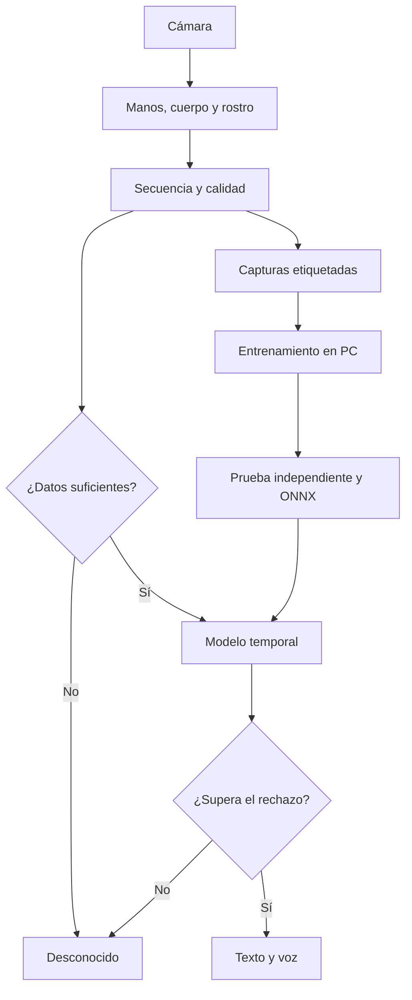

# Arquitectura de ConectaLSCh — revisión de v1.5.3 y decisión inicial

Fecha: 30 de septiembre de 2026. Archivo auditado: `ConectaLSCh-v1.5.3(1).zip`.

## Diagnóstico basado en el código recibido

| Hallazgo | Código | Consecuencia probable |
|---|---|---|
| MediaPipe detecta puntos de manos; la etiqueta se decide comparando ejemplos locales | `visual-provider.js`, `temporal-sequence.js` | No existe un modelo entrenado en LSCh en el paquete. Grabar ejemplos no equivale a entrenar una red neuronal. |
| Las manos se reordenan por x en cada fotograma | `feature`, `motionSequence`, `handKinematicSequence` de `recognition-math.js` | Al cruzarse pueden intercambiar su identidad y alterar artificialmente la trayectoria. |
| La actividad se calcula con el centro promedio de las manos | `handCenterAndScale` en `motion-event.js` original | Movimientos de dos manos en sentidos contrarios pueden cancelarse. |
| La forma se normaliza respecto a la muñeca y parte de la trayectoria respecto al inicio | `recognition-math.js` | Se pierde información de la ubicación de la mano respecto al cuerpo/rostro. Eso puede confundir movimientos con formas parecidas. |
| El contexto facial/corporal se compara usando promedios | `meanDesc`, `visualDistance` en `multimodal.js` | Dos secuencias con expresiones en distinto orden pueden tener el mismo promedio. |
| Las variantes de una etiqueta comparten el mismo grupo de consenso | `chooseSign` | Mezclar ejemplos de mano derecha, izquierda o variantes distintas puede exigir coincidencias entre ejemplos incompatibles. |
| Una pérdida de manos o tiempo máximo puede cerrar un evento | `MotionEventSegmenter` original | Un movimiento incompleto puede llegar al clasificador como si hubiera terminado. |
| La captura exige movimiento para todos los ejemplos | `capturePersonalExample` original | No permite enseñar correctamente posturas fijas y usa el desplazamiento de muñeca como parte importante del criterio. |
| Umbrales y consenso manuales, sin evaluación por persona/sesión | `recognition-state.js`, pruebas | No hay evidencia de precisión, generalización o tasa de falsos positivos en cámara real. |
| Metadatos de versión inconsistentes | `README.md` 1.4.1 e `index.html` 1.5.2 dentro del ZIP 1.5.3 | Dificulta saber qué implementación se está probando. |

Son explicaciones técnicamente plausibles de los síntomas de Alberto. Sin vídeos etiquetados no se puede atribuir una falla particular de HOLA/GRACIAS a una única causa.

## Decisión de tecnología

| Capa | Elección | Motivo y límite |
|---|---|---|
| Visión | MediaPipe Hand/Pose/Face Landmarker; evaluar Holistic Landmarker como extractor unificado | Extrae articulaciones y expresiones en dispositivo. No traduce LSCh. Holistic está documentado para web, Python, iOS y Android; debemos comprobar SDK, rendimiento y equivalencia en los dispositivos concretos antes de migrar. |
| Representación | Secuencias con identidad de manos, tiempos, ubicación relativa, expresiones y máscaras | Conserva canales relevantes y distingue «ausente» de «valor cero». |
| Línea base del piloto | Comparación temporal de ejemplos v4 | Permite corregir mecánica y recopilar datos ahora. Los umbrales siguen siendo experimentales y su coste crece con el número de muestras. |
| Aprendizaje en PC | Python + PyTorch, primera línea base: CNN temporal pequeña | Es una propuesta inicial para medir. Aprende evolución de articulaciones; permite empezar con CPU. Después compararemos con modelos de grafos/transformadores según los errores y datos disponibles. |
| Intercambio de modelo | ONNX con un contrato de entrada común | Evita mantener tres clasificadores distintos. La conversión exige pruebas de equivalencia y operadores compatibles; no convierte automáticamente todo el producto en apps nativas. |
| Web | ONNX Runtime Web, WebAssembly como primera opción | Mantiene un camino de CPU para iPhone/Safari y navegadores sin aceleración disponible. WebGPU se evaluará por dispositivo. |
| iPhone/Android nativos | MediaPipe por plataforma + ONNX Runtime Mobile | Swift/Kotlin para cámara, permisos y ciclo de vida. Medir CoreML/XNNPACK u otros proveedores antes de elegir aceleración. |

La PWA alfa mantiene el SDK de visión del archivo recibido (`0.10.22-rc.20250304`) y añade correcciones alrededor de sus resultados. No se ha validado una actualización de modelos/SDK en hardware real. Los detectores de cuerpo y rostro muestrean alternadamente y guardan sus tiempos de origen; no son tres canales capturados exactamente en el mismo fotograma. Antes de producción, migrar a un extractor unificado o congelar y distribuir el mismo fotograma a los detectores, y mover la inferencia a un Worker en web.

## Flujo objetivo

«Desconocido» es una salida necesaria: nunca obligar al sistema a elegir la seña más cercana. Un score softmax tampoco es, por sí solo, una probabilidad fiable de que la traducción sea correcta.

## Contrato que se implementa en la alfa

Cada captura v4 guarda los puntos, tiempos y metadatos, junto a un vector de **216 valores por observación**:

- Dos manos: 73 valores por mano = 63 coordenadas relativas a muñeca, 2 posiciones de muñeca en imagen, 2 respecto a hombros, 2 respecto al rostro y 4 indicadores de presencia/contexto/identidad.
- Seis puntos de brazos/hombros: 18 valores de xy y presencia.
- Seis puntos faciales seleccionados: 18 valores de xy y presencia.
- Dieciséis coeficientes de expresión: 32 valores de estimación y presencia.
- Dos indicadores globales de ancla corporal/facial.

`z` de manos es profundidad estimada relativa a la muñeca, no una distancia global en metros compartida con el rostro/cuerpo. El motor no certifica visibilidad de labios a través de manos/mascarillas. Los coeficientes faciales son estimaciones y pueden fallar ante oclusiones.

Python y el adaptador ONNX consumen 48 observaciones seleccionadas por sus tiempos, con el mismo criterio de vecino más próximo; no interpolan máscaras. La normalización del clasificador se calcula únicamente con entrenamiento y se incorpora al modelo. Cambiar extractor o contrato exige versionar y repetir la evaluación.

Las muestras antiguas no contienen suficiente información para fabricar estos canales. Se conservan como compatibles y se vuelven a grabar las etiquetas prioritarias.

## Ruta de trabajo y criterio de avance

1. **Prueba de mecánica ahora:** dos ejemplos por variante/mano de HOLA y GRACIAS; confirmar que se capturan completos y que el detector mantiene ambas identidades. Esta prueba no demuestra generalización.
2. **Piloto pequeño:** HOLA, GRACIAS, SÍ, NO y AYÚDAME, con sus variantes validadas por usuarios LSCh. Reunir aproximadamente 20–30 repeticiones por variante/mano a lo largo de al menos tres sesiones. Añadir movimientos cotidianos y reposo como negativos. El número es un punto de partida, no una garantía estadística.
3. **Entrenamiento y evaluación:** separar sesiones completas para un modelo personal; separar personas completas para evaluar un modelo general. Nunca distribuir fotogramas de un mismo vídeo entre entrenamiento y prueba. Registrar precisión por seña, recall, macro-F1, confusiones, cobertura tras rechazo y falsos positivos.
4. **Ensayo continuo en cámara:** contar falsos positivos durante minutos de movimientos cotidianos, además de probar vídeos recortados. Medir latencia desde el final de la seña, FPS, oclusiones y memoria en el iPhone/Android concretos.
5. **Escala gradual:** aumentar a 20, 50 y 100 etiquetas según evidencia. Para miles de señas sustituir la búsqueda entre todos los ejemplos por inferencia neuronal, embeddings para adaptación personal y datos de muchas personas/regiones. Anotar forma, mano dominante, ubicación, dirección, contacto, variante y componentes no manuales.
6. **Lengua continua:** el motor actual reconoce señas aisladas con final estable. Conversaciones requieren coarticulación, segmentación aprendida y modelos de secuencia; reconocer palabras aisladas no demuestra traducción de frases.

Como objetivos iniciales de evaluación se pueden plantear ≥95% de precisión en salidas aceptadas, ≥80% de cobertura de señas conocidas y ≤5% de aceptación de negativos recortados. Son objetivos, no resultados de esta entrega. Una muestra pequeña no prueba esos límites en la población. Para uso general hacen falta personas nuevas, variantes, iluminación, cámaras y negativos no vistos.

Un usuario sordo competente en LSCh y revisión lingüística deben decidir las etiquetas/variantes. No sustituir datos de otras lenguas de señas por LSCh ni aplicar un espejo universal: puede alterar lateralidad, ubicación o direccionalidad. Se puede grabar con iPhone y entrenar en un PC que no tenga cámara.

## Voz/texto → avatar

En el ZIP auditado no aparece una implementación de traducción a un avatar LSCh. Es un módulo adicional al reconocimiento. Necesita traducción de español a estructura LSCh, decisiones de referencia espacial y componentes no manuales, y animaciones validadas. Una primera etapa razonable es un catálogo pequeño de frases y animaciones revisadas; concatenar una seña por palabra española no garantiza una oración LSCh correcta. La salida de Face Landmarker tampoco resuelve esa traducción.

## Referencias técnicas primarias verificadas

- [MediaPipe Hand Landmarker web](https://developers.google.com/edge/mediapipe/solutions/vision/hand_landmarker/web_js).
- [MediaPipe Face Landmarker web](https://developers.google.com/edge/mediapipe/solutions/vision/face_landmarker/web_js), incluido bloqueo de hilo e inferencia en Worker.
- [MediaPipe Holistic](https://developers.google.com/edge/mediapipe/solutions/vision/holistic_landmarker) y [guía web](https://developers.google.com/edge/mediapipe/solutions/vision/holistic_landmarker/web_js).
- [Exportador ONNX de PyTorch](https://docs.pytorch.org/docs/2.14/onnx_export.html).
- [ONNX Runtime Web](https://onnxruntime.ai/docs/get-started/with-javascript/web.html) y [Mobile](https://onnxruntime.ai/docs/get-started/with-mobile.html).

Las decisiones de arquitectura y los objetivos anteriores son propuestas del proyecto, no afirmaciones de esas documentaciones sobre precisión en LSCh.
